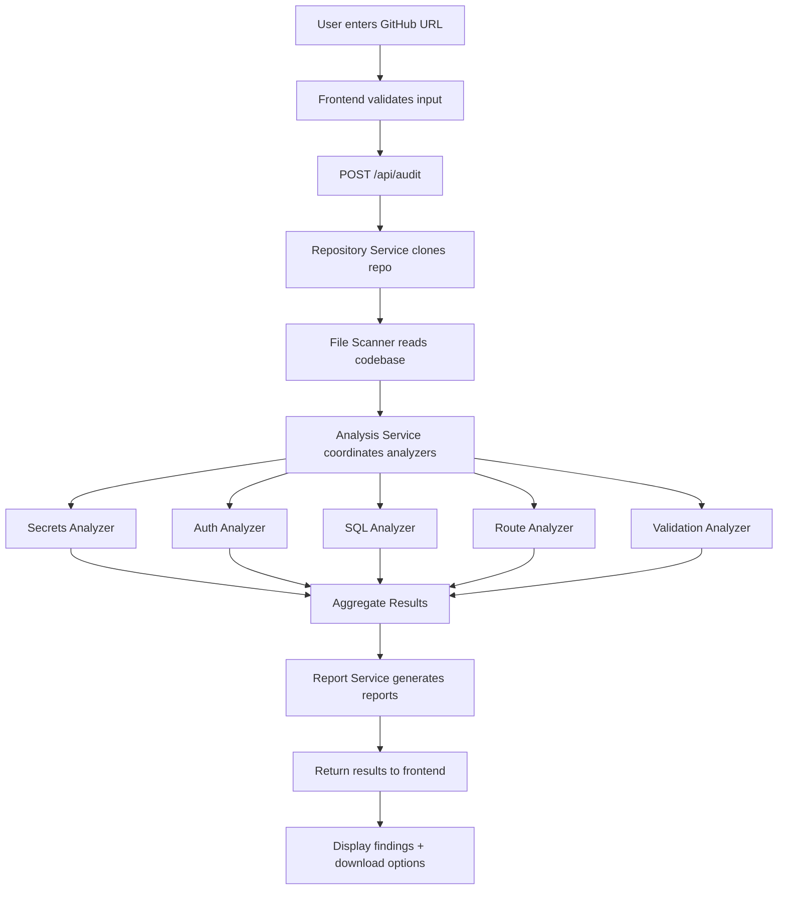

# CodeGuard - Project Architecture & Implementation Plan

## 📁 Project Directory Structure

```
codeguard/
├── src/
│   ├── server.js                 # Main Express server entry point
│   ├── config/
│   │   └── config.js            # Configuration management
│   ├── controllers/
│   │   └── auditController.js   # Handles audit requests
│   ├── services/
│   │   ├── repoService.js       # GitHub repo cloning/fetching
│   │   ├── analysisService.js   # Orchestrates security analysis
│   │   └── reportService.js     # Generates JSON/HTML reports
│   ├── analyzers/
│   │   ├── secretsAnalyzer.js   # Detects hardcoded secrets/API keys
│   │   ├── authAnalyzer.js      # Checks for missing authentication
│   │   ├── sqlAnalyzer.js       # SQL injection vulnerability detection
│   │   ├── routeAnalyzer.js     # Exposed routes analysis
│   │   └── validationAnalyzer.js # Input validation checks
│   ├── utils/
│   │   ├── fileScanner.js       # Recursively scans repository files
│   │   ├── patterns.js          # Regex patterns for vulnerability detection
│   │   └── logger.js            # Logging utility
│   └── templates/
│       └── report.html          # HTML report template
├── public/
│   ├── index.html               # Main UI page
│   ├── css/
│   │   └── styles.css           # Application styling
│   └── js/
│       └── app.js               # Frontend JavaScript logic
├── temp/                        # Temporary directory for cloned repos
├── reports/                     # Generated audit reports
├── tests/
│   ├── analyzers.test.js        # Unit tests for analyzers
│   └── integration.test.js      # Integration tests
├── .env.example                 # Environment variables template
├── .gitignore                   # Git ignore rules
├── package.json                 # Node.js dependencies
└── README.md                    # Project documentation
```

## 🔧 Core Components Breakdown

### 1. Server Layer (src/server.js)
- Express.js setup with middleware (CORS, body-parser, static files)
- API routes:
  - `POST /api/audit` - Trigger security audit
  - `GET /api/audit/:id` - Get audit status/results
  - `GET /api/reports/:id` - Download report

### 2. Repository Service (src/services/repoService.js)
- Clone GitHub repositories using `simple-git` or `isomorphic-git`
- Validate GitHub URLs
- Handle authentication (public/private repos)
- Clean up temporary files after analysis

### 3. Security Analyzers (src/analyzers/)

**Secrets Analyzer:**
- Detect hardcoded API keys, tokens, passwords
- Patterns: AWS keys, GitHub tokens, database credentials, private keys
- Check common files: .env, config files, source code

**Auth Analyzer:**
- Identify unprotected routes/endpoints
- Check for missing authentication middleware
- Detect exposed admin panels

**SQL Analyzer:**
- Find SQL injection vulnerabilities
- Check for string concatenation in queries
- Identify missing parameterized queries

**Route Analyzer:**
- Map all exposed endpoints
- Identify sensitive routes without protection
- Check HTTP methods (DELETE, PUT without auth)

**Validation Analyzer:**
- Find missing input validation
- Check for XSS vulnerabilities
- Identify unvalidated user inputs

### 4. Report Service (src/services/reportService.js)
- Generate JSON reports with:
  - Vulnerability summary
  - Severity levels (Critical, High, Medium, Low)
  - File locations and line numbers
  - Remediation suggestions
- Generate HTML reports with:
  - Visual dashboard
  - Color-coded severity indicators
  - Code snippets with highlights
  - Actionable recommendations

### 5. Frontend UI (public/)
- Clean, modern interface
- Input form for GitHub URL
- Real-time progress indicator
- Results display with:
  - Vulnerability count by severity
  - Detailed findings list
  - Download options (JSON/HTML)
  - Code snippets with line numbers

## 📊 System Architecture Flow



## 🔍 Key Security Patterns to Detect

### Hardcoded Secrets:
- `password\s*=\s*["'][^"']+["']`
- `api[_-]?key\s*=\s*["'][^"']+["']`
- `AKIA[0-9A-Z]{16}` (AWS Access Key)
- `ghp_[a-zA-Z0-9]{36}` (GitHub Personal Access Token)
- `mongodb://.*:.*@` (MongoDB connection strings)
- `postgres://.*:.*@` (PostgreSQL connection strings)

### SQL Injection:
- String concatenation in queries: `"SELECT * FROM users WHERE id = " + userId`
- Missing parameterized queries
- Direct user input in SQL statements
- Unsafe query builders

### Missing Authentication:
- Routes without middleware checks
- Unprotected admin endpoints
- Missing JWT/session validation
- Exposed sensitive operations

### Input Validation:
- Missing sanitization on user inputs
- Unvalidated file uploads
- Missing XSS protection
- Unsafe eval() usage

## 📦 Dependencies (package.json)

### Core:
- `express` (^4.18.0) - Web framework
- `simple-git` (^3.19.0) - Git operations
- `dotenv` (^16.0.0) - Environment variables
- `cors` (^2.8.5) - CORS handling

### Analysis:
- `glob` (^10.0.0) - File pattern matching
- `fs-extra` (^11.0.0) - Enhanced file operations

### Utilities:
- `uuid` (^9.0.0) - Generate unique audit IDs
- `winston` (^3.8.0) - Logging

### Development:
- `nodemon` (^3.0.0) - Auto-restart during development
- `jest` (^29.0.0) - Testing framework

## 🎯 Implementation Priority

### Phase 1 - Core Functionality:
1. Project setup and Express server
2. Repository cloning service
3. Basic file scanner
4. One analyzer (secrets) as proof of concept
5. Simple JSON report generation

### Phase 2 - Full Analysis:
6. Implement all 5 analyzers
7. HTML report generation
8. Frontend UI

### Phase 3 - Polish:
9. Error handling and validation
10. Testing and documentation
11. Performance optimization

## 🚀 Deployment Considerations

- Use environment variables for sensitive config
- Implement rate limiting to prevent abuse
- Add request timeouts for large repositories
- Clean up temp directories regularly
- Consider containerization (Docker) for easy deployment
- Set up proper logging and monitoring

## 📝 File-by-File Implementation Guide

### Configuration Files:

**package.json:**
- Project metadata
- Dependencies list
- Scripts (start, dev, test)

**.gitignore:**
- node_modules/
- temp/
- reports/
- .env
- *.log

**.env.example:**
- PORT=3000
- NODE_ENV=development
- TEMP_DIR=./temp
- REPORTS_DIR=./reports
- MAX_REPO_SIZE_MB=100

### Source Files (26 files total):

1. **src/server.js** - Express server setup
2. **src/config/config.js** - Configuration loader
3. **src/controllers/auditController.js** - Request handlers
4. **src/services/repoService.js** - Git operations
5. **src/services/analysisService.js** - Analysis orchestration
6. **src/services/reportService.js** - Report generation
7. **src/analyzers/secretsAnalyzer.js** - Secrets detection
8. **src/analyzers/authAnalyzer.js** - Auth checks
9. **src/analyzers/sqlAnalyzer.js** - SQL injection detection
10. **src/analyzers/routeAnalyzer.js** - Route analysis
11. **src/analyzers/validationAnalyzer.js** - Validation checks
12. **src/utils/fileScanner.js** - File system operations
13. **src/utils/patterns.js** - Regex patterns
14. **src/utils/logger.js** - Logging utility
15. **src/templates/report.html** - HTML report template
16. **public/index.html** - Main UI
17. **public/css/styles.css** - Styling
18. **public/js/app.js** - Frontend logic
19. **tests/analyzers.test.js** - Unit tests
20. **tests/integration.test.js** - Integration tests

## 🎨 UI Design Specifications

### Color Scheme:
- Critical: #dc3545 (Red)
- High: #fd7e14 (Orange)
- Medium: #ffc107 (Yellow)
- Low: #28a745 (Green)
- Info: #17a2b8 (Blue)

### Layout:
- Header with CodeGuard branding
- Input section with GitHub URL form
- Progress indicator during analysis
- Results dashboard with severity breakdown
- Detailed findings table with filtering
- Download buttons for reports

## 🔐 Security Best Practices

1. Validate all user inputs
2. Sanitize GitHub URLs
3. Limit repository size
4. Implement request timeouts
5. Clean up temporary files
6. Use secure file operations
7. Implement rate limiting
8. Log all operations
9. Handle errors gracefully
10. Never expose sensitive data in responses